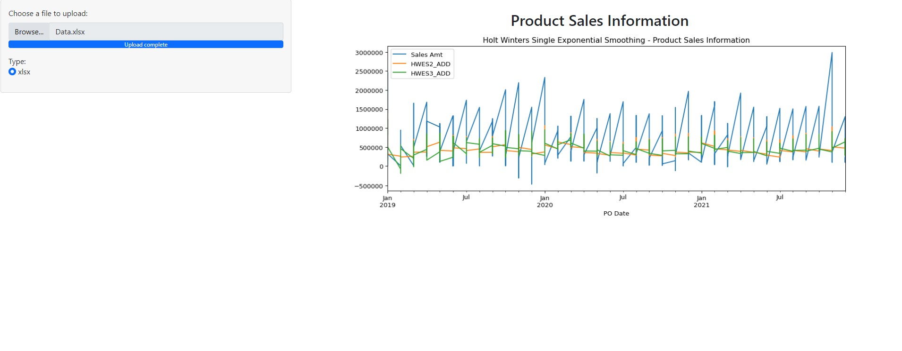

# Thirtha Shiny Application - Product Sales Information Forecast



## Project Overview

The aim of this project is to create a Shiny for Python application to forecast the product sales over the next 24 months using the data provided in the given `Data.xlsx` document. The data should be uploaded in the web application and the output graph should showcase the forecasted growth of product sales using Holt-Winters Seasonal forecasting model.

When deciding which Holt-Winters forecasting model to use, I first had to perform the seasonal decomposition to check if there is a trend component to the model. After plotting the seasonal decomposition and determining the trend component, I found that Holt-Winters Single Exponential Smoothing was not appropriate and did not fit well with the data.

Hence, I performed Holt-Winters Double and Triple Exponential Smoothing to better fit the data set. Also, I had to use 'additive' instead of 'multiplicative' trends due to negative components existing in the data set.

Unfortunately I ran out of time to extrapolate the data for 24 months, but to do so, I would first have to split the existing data set into a trained data set and test data set to perform the prediction. I opted to split the data set 75/25 % in order to do this. However, I could not render the plot.

## Installation

1. Clone repository to local pc

    ```
    git clone https://github.com/Thirthamk/shiny_app.git
    ```

2. Install required python libraries

    ```
    pip install -r requirements.txt
    ```

3. Run the shiny app in the parent directory of application

    ```
    shiny run --reload app/app.py
    ```

## Using the Application

1. Browse to webpage on `http://127.0.0.1:8000`

2. Upload `Data.xlsx` file as input in browser and graph will render on webpage

Alternatively, browse to the deployed application on `https://shinyapps.io/`
